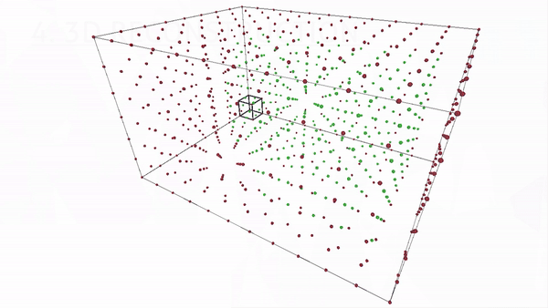

##### NeuronArchitect - Reconstruction and visualisation of 3D neural morphology from two-photon imaging data #####

Unity desktop application for reconstructing and visualizing 3D neural morphology, using the Marching cubes computer graphics algorithm. 

We have provided both Sample data ready to use with the application and the Raw unprocessed data (Both before and after Cellpose).

These datasets can be vizualized in ImageJ --> Link to download: https://imagej.nih.gov/ij/

The Raw Cerrebelllar Cortex data-set can be run in Cellpose --> Link to download: https://github.com/mouseland/cellpose

The SaveToBinary jupyter notebook in the Resources folder can be used to save the data-sets in 16 bit binary format that
is required by the application

The Project files folder can be opened in the unity editor to modify the project. The Unity editor needs to be installed first. 

RUNNING THE APPLICATION
 
In order to run the application, run the NeuronArchitect.exe from the build directory after unzipping all the files. 

In the start menu click the NEW PROJECT button to create a  new project and use the setting below based on the data set you want to use.

Cerrebellar cortex masks binary:

-- Image width (pixels): 512

-- Image height (pixels): 512

-- Image width (microns): 712

-- Image height (microns): 712

-- Image spacing (microns): 2

-- Sampling rate: 1 // This value can changed in order to modify the level of detail. Recommended range: 0.5 - 4

-- Folder path: Navigate to the Sample data folder and choose the folder mathcing the name of the data set

Cerrebellar cortex masks binary - cropped(100x100) 1, 2, 3 and single colour:

-- Image width (pixels): 100

-- Image height (pixels): 100

-- Image width (microns): 139

-- Image height (microns): 139

-- Image spacing (microns): 2

-- Sampling rate: 1 // This value can changed in order to modify the level of detail. Recommended range: 0.5 - 4

-- Folder path: Navigate to the Sample data folder and choose the folder mathcing the name of the data set

Once the settings are inputted, click the RENDER button to reconstruct the neurons. 

Based on the data-set, the render times might vary so patiently wait for the visualization menu to be displayed. This
process should take at most 10 seconds. If nothing happens, click the BACK button, quit the application and start again. 

In order to run a new project, the application must be closed and then run again.

Navigation: 

Press the Q & E keys to rotate the meshes in the horizontal axis.

Press the Z & C keys to rotate the meshes in the vertical axis. 

Click on a neuron in order to display their positional properties, size and volume.

Click anywhere else to display the OVERVIEW  panel again. 

